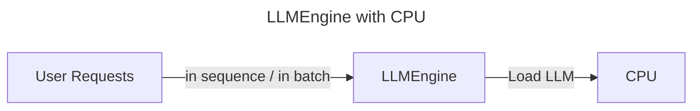
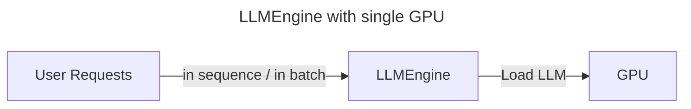
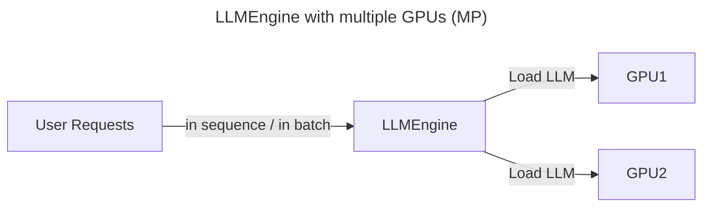
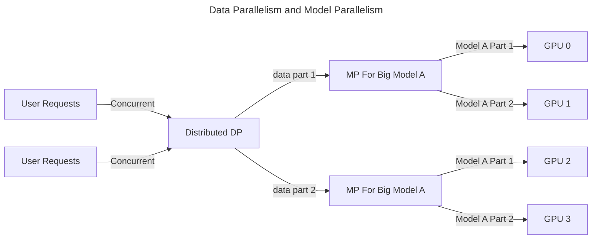

# LLM Inference setups.

In this project, there will be 2 CRDs:

* `LLMEngine`: a server that accpets client requests and do the LLM inference then returns the response.
   - `Ollama`: A server that easily starts with small LLMs. It has GPU support as well.

* `LLMModel`: A CRD which represents the LLM model, which engine will be running on, and others.

The followings describe the setups on the scope of the direct `LLMEngine` and `LLMModel` serving without consideration of autoscalling, node affinity, model downloading, etc.

## LLMEngine with CPU

## LLMEngine with a single GPU

> NOTE: users can specify which GPU to use in case there are multiple GPUs available: `CUDA_VISIBLE_DEVICES: 0` for the first one, etc. `ROCR_VISIBLE_DEVICES: 0` for AMD GPU cards.

## LLMEngine with multiple GPUs (MP)

> NOTE: by default, each LLMEngine only uses one GPU, the other will be idle. so it needs the LLMEngine to support to use multiple GPUs, typically called: model parallelism (MP).

> NOTE: It woulbe the best pratice to bind each GPU with each `LLMModel` serving. For large model that one GPU cannot load, uses Model Parallelism (MP) to load it using multiple GPUs, and we can set up a Data Parallelism before it to distribute the requests.

## DP and MP

> NOTE: in the above setup, the same `Big Model A` gets loaded by 2 GPUs, and there are 2 replicas.
